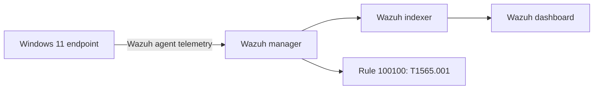
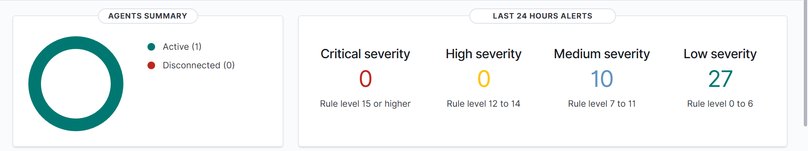
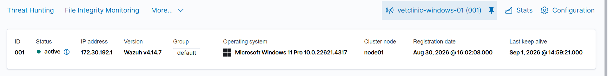
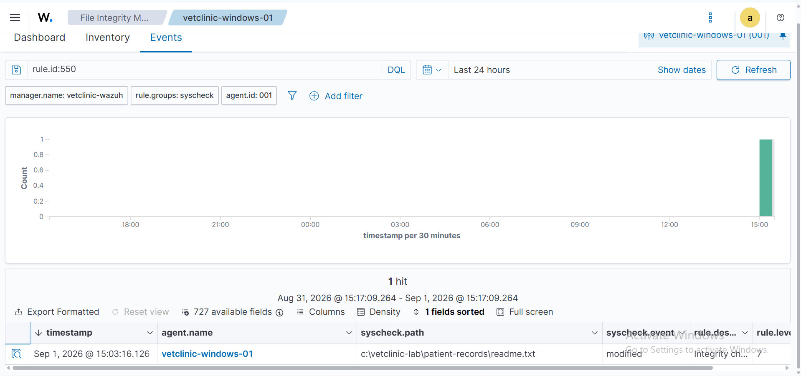
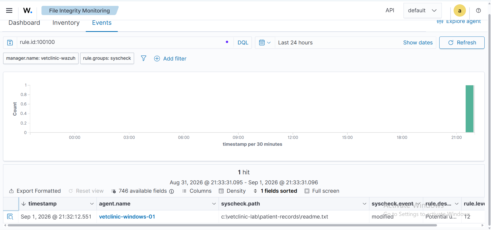
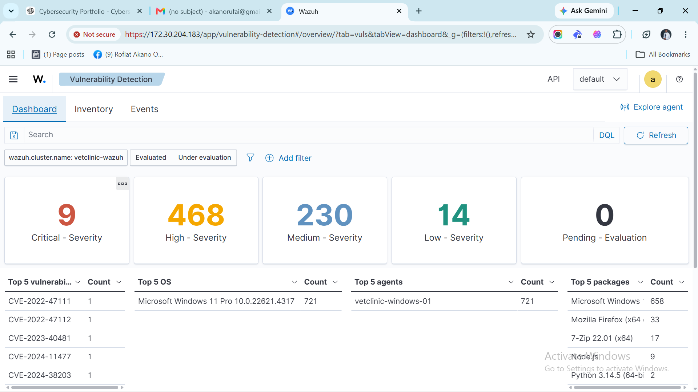

# VetClinic Wazuh SIEM and Endpoint Monitoring Lab


## Executive summary

This project documents the design and validation of a small security operations lab for a fictional veterinary clinic. An all-in-one Wazuh server was deployed on an Ubuntu virtual machine in Microsoft Hyper-V, and a Windows 11 endpoint was enrolled as `vetclinic-windows-01`.

The lab collects endpoint security telemetry, monitors a simulated patient-record directory, assesses the endpoint against a CIS Windows benchmark, and identifies vulnerable software. A custom Wazuh rule raises a level-12 alert when the monitored patient-record file changes and maps the activity to MITRE ATT&CK technique **T1565.001: Stored Data Manipulation**.

All activity was performed on an authorised personal lab. No production patient data, malware, or third-party system was used.

## Project objectives

- Deploy and validate a functional Wazuh SIEM environment.
- Enrol and monitor a Windows 11 endpoint.
- Detect changes to a sensitive simulated patient-record file.
- Engineer and validate a custom high-severity detection rule.
- Map the detection to MITRE ATT&CK.
- Review vulnerability and CIS configuration-assessment findings.
- Document evidence, security implications, and remediation priorities.

## Architecture



The Ubuntu VM receives a private DHCP address from Hyper-V's Default Switch. That address can change after the host restarts, so the Windows agent's manager address is verified whenever the lab resumes.

## Lab environment

| Component | Configuration |
| --- | --- |
| Host | Windows 11 Pro, AMD Ryzen 5 PRO 5650U, 16 GB RAM |
| Virtualisation | Microsoft Hyper-V |
| SIEM server | Ubuntu Server 24.04 LTS virtual machine |
| SIEM platform | Wazuh 4.14.7 all-in-one deployment |
| Endpoint | Windows 11 Pro |
| Agent | `vetclinic-windows-01`, agent ID `001` |
| Monitored path | `C:\VetClinic-Lab\Patient-Records\readme.txt` |
| Custom rule | ID `100100`, level `12` |
| ATT&CK mapping | `T1565.001` — Stored Data Manipulation |

## Implementation

### 1. Wazuh deployment and endpoint enrolment

The Wazuh manager, indexer, dashboard, and Filebeat services were deployed on the Ubuntu VM. The Windows Wazuh agent was installed, pointed to the manager, and verified as active.





### 2. File integrity monitoring

The lab monitors a simulated patient-record file. An authorised PowerShell command appended a timestamped test entry, allowing the detection path to be tested without using real patient information.

```powershell
Add-Content "C:\VetClinic-Lab\Patient-Records\readme.txt" "Authorised FIM test - $(Get-Date -Format 'yyyy-MM-dd HH:mm:ss')"
```

Wazuh's standard FIM rule `550` detected the checksum change and recorded the file path and `modified` action.



### 3. Custom detection engineering

To assign a higher priority to simulated patient-record changes, a custom child rule was created from Wazuh rule `550`:

```xml
<group name="syscheck,vetclinic,fim,windows,">
  <rule id="100100" level="12">
    <if_sid>550</if_sid>
    <field name="file">readme.txt</field>
    <description>Potential unauthorized modification of VetClinic patient record: $(file)</description>
    <mitre>
      <id>T1565.001</id>
    </mitre>
  </rule>
</group>
```

The rule was validated with `wazuh-analysisd -t`, the manager was restarted, and a controlled file modification generated a level-12 alert.



The complete rule is available at [`rules/vetclinic_rules.xml`](rules/vetclinic_rules.xml).

### 4. Vulnerability management

Wazuh identified **721 findings** across the Windows endpoint during the documented scan: 9 critical, 468 high, 230 medium, and 14 low. Affected components included the Windows operating system, Mozilla Firefox, 7-Zip, Node.js, and Python.

These figures represent scanner findings, not proof that every issue is exploitable. Remediation should account for CVE validation, patch availability, exposure, asset criticality, and operational impact.



### 5. Security configuration assessment

The Wazuh Security Configuration Assessment module evaluated the endpoint against the CIS Microsoft Windows 11 Enterprise Benchmark. The initial assessment showed substantial hardening gaps, supporting a phased remediation plan focused on endpoint policy, access control, audit settings, and attack-surface reduction.

When captured, add `screenshots/06-security-configuration-assessment.png` here.

### 6. Windows security telemetry

Windows Defender scan events were reviewed in Threat Hunting to verify that endpoint security activity reached the SIEM and could be investigated by agent, description, severity, and rule ID.

When captured, add `screenshots/07-windows-defender-event.png` here.

### 7. MITRE ATT&CK mapping

The custom detection is mapped to **T1565.001: Stored Data Manipulation**, representing unauthorised changes to stored information. In a real veterinary environment, monitoring sensitive clinical or administrative records can help identify tampering, destructive activity, or misuse of privileged access.

When captured, add `screenshots/08-mitre-mapping-custom-alert.png` here.

## Key findings

| Finding | Evidence | Risk | Priority |
| --- | --- | --- | --- |
| Simulated patient-record changes are visible to Wazuh | Rules 550 and 100100 | Unauthorised record manipulation could affect integrity and trust | High |
| Custom rule escalates sensitive changes to level 12 | Rule 100100 alert | Faster analyst prioritisation is possible | High |
| Multiple critical and high vulnerability findings exist | Vulnerability dashboard | Exploitable software could enable compromise | Critical |
| CIS assessment indicates substantial hardening gaps | SCA dashboard | Weak endpoint configuration increases attack surface | High |
| Defender events reach the SIEM | Threat Hunting evidence | Central investigation and correlation are possible | Medium |

## Recommended remediation

1. Validate critical and high findings against the exact installed versions, vendor advisories, and actual endpoint exposure.
2. Patch the operating system and supported third-party applications, beginning with internet-facing or commonly exploited components.
3. Remove unsupported or unnecessary software and document approved exceptions.
4. Apply failed CIS controls in staged groups, testing operational impact before enforcement.
5. Restrict access to patient-record directories using least privilege and role-based access.
6. Forward high-severity alerts into an incident-handling workflow and define an owner, triage target, and escalation path.
7. Establish an approved-change process so authorised maintenance can be distinguished from suspicious modification.
8. Retest FIM, vulnerability, Defender, and configuration-assessment controls after remediation.

Detailed analysis is available in [`docs/findings-and-remediation.md`](docs/findings-and-remediation.md).

## Skills demonstrated

- SIEM deployment and administration
- Windows endpoint onboarding
- File integrity monitoring
- Detection engineering and rule validation
- MITRE ATT&CK mapping
- Threat hunting and event filtering
- Vulnerability prioritisation
- CIS benchmark assessment
- Evidence collection and security documentation
- Hyper-V virtual lab troubleshooting

## Repository structure

```text
.
├── README.md
├── START-HERE.md
├── docs/
│   ├── findings-and-remediation.md
│   └── lab-build-notes.md
├── rules/
│   └── vetclinic_rules.xml
└── screenshots/
```

## Limitations and future improvements

- The lab uses one Windows endpoint and an all-in-one Wazuh server; it does not represent a resilient production cluster.
- Hyper-V Default Switch addressing is dynamic and is unsuitable for a permanent deployment.
- Findings require contextual validation before they should be treated as confirmed exploitable vulnerabilities.
- Future work could add Sysmon telemetry, email or ticketing integration, role-based dashboard access, automated rule testing, and a second endpoint for comparative analysis.

## Ethical and privacy statement

This project was conducted only on systems owned and authorised by the project creator. The `Patient-Records` directory contains simulated text and no real clinical or personal data. Credentials, private keys, and authentication material are intentionally excluded from this repository.
